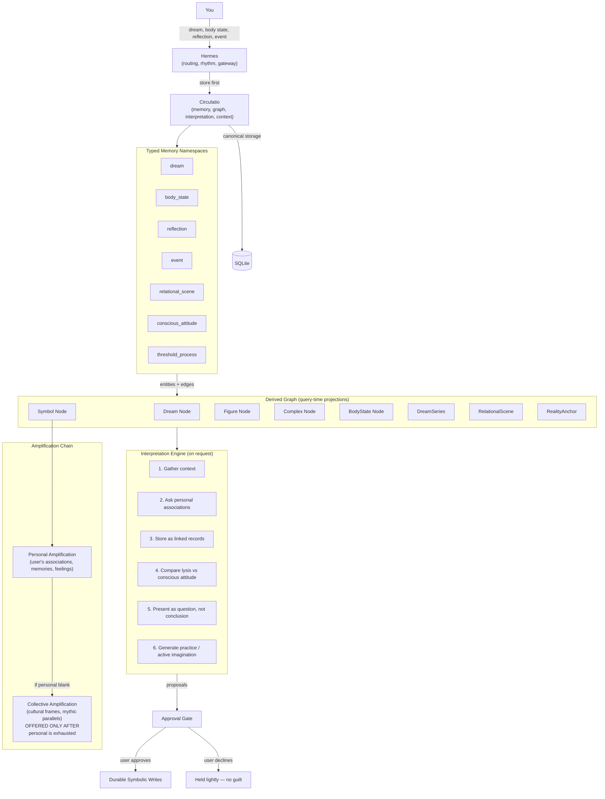

# Circulatio

> A companion for soul-making, where pattern and meaning surface.

A memory system for depth. Circulatio collects dreams, body states, reflections, and charged events, then surfaces long-term patterns — on your timing, with your consent. It does not diagnose, gamify, or optimize. It holds, remembers, and sees.

<p align="center">
  
</p>

It does not chase you. It does not gamify you. It does not collapse your symbols into productivity tips.

It **holds** first. It **remembers** what you forget. It **surfaces patterns** you cannot yet hold alone. And when you ask, it **interprets** with evidence, cultural amplification, and care for your conscious situation.

---

## Quickstart

```bash
git clone https://github.com/Sophanos/circulatio.git
cd circulatio
python -m venv .venv
source .venv/bin/activate
pip install -e ".[dev]"
python -m pytest tests/
```

**Already installed?**
```bash
pip install -e ".[dev]" --upgrade
```

**Evaluate method quality:**
```bash
.venv/bin/python scripts/evaluate_circulatio_method.py --strict
```

---

## What This Is

Circulatio is for people doing inner work — not as an escape from life, but as the ground beneath it.

- You remember dreams and sense they mean something, but you do not know how to read them.
- You feel patterns repeating and want to understand them at depth, not just manage symptoms.
- You believe the body carries intelligence and want to connect somatic experience with symbolic life.
- You are interested in Jungian depth psychology, archetypes, and individuation — but you want a practical tool, not just theory.
- You want a **witness** that accumulates with you, not a dashboard that reports on you.

## The Daily Rhythm

| Time | Experience |
|------|------------|
| **Morning** | A brief pattern surfacing — *"You dreamed of water three times this month. Yesterday you noted chest tension before a meeting. Want a 3-minute body check-in?"* You choose. No guilt. |
| **Day** | Drop a fragment: a dream, a body sensation, a strange coincidence, a mood shift. Circulatio stores it. It **holds** without pressing. |
| **Evening** | You ask: *"What is alive today?"* It weaves the morning's tension into the recurring water symbol, offers a cultural parallel as invitation, and asks a gentle question. |
| **Weekly** | A deeper synthesis: what recurred, what shifted, what was avoided, what new symbol emerged, what goal tension is visible. You read it like a journal you did not write alone. |

## Architecture

Circulatio is a **durable backend** with a Hermes plugin bridge. Hermes owns routing, session orchestration, and scheduling. Circulatio owns:

- **Memory kernel** — typed, privacy-classed, provenance-bound
- **Graph engine** — derived symbol-to-symbol projections, no external graph DB
- **Context derivation** — native life-context built from your own records
- **Coach operating contract** — derived `coachState` attached to enriched method context, shared by `alive_today`, rhythmic briefs, journey pages, practice, and reply routing
- **LLM-first interpretation** — structured depth output with safety backstops
- **Approval flows** — symbolic writes are proposals until you accept them
- **Proactive runtime** — `alive_today`, rhythmic briefs, journey pages, and weekly reviews
- **Analysis surfaces** — threshold reviews, living myth reviews, and bounded analysis packets
- **Practice lifecycle** — recommendations, follow-ups, and integration, held lightly



## What Is Possible

- **Hold without hurry.** Drop a dream, a body sensation, a charged moment. It waits. It does not interpret until you ask, or until the pattern itself demands attention.
- **See pattern across time.** A symbol that returns in dreams, body states, and relational scenes becomes visible not as coincidence, but as recurrence with weight.
- **Depth when you are ready.** Interpretation is offered, never imposed. Symbolic writes are proposals until you accept them. You set the depth and the pace.
- **Treat the body as symbol.** Somatic events carry the same hermeneutic gravity as dreams. Tension is not a symptom to manage; it is a message to hold.
- **Cultural resonance, not explanation.** Mythic and artistic parallels are offered as amplification — something that resonates, not something that proves.
- **A witness that accumulates.** Not a dashboard. Not a coach. A companion that remembers what you forget and surfaces what you cannot yet hold alone.
- **Proactive rhythm.** Brief check-ins, weekly synthesis, and journey pages arrive on a rhythm you consent to. You can always say not now.
- **Embeddable and open.** Built as a backend you can plug into an agent, script against, or run locally when the time is right.

## How It Interprets

Circulatio does not guess meanings from a symbol dictionary. It follows a hermeneutic method rooted in Jung, Marie-Louise von Franz, and Robert A. Johnson:

- **Dreams are letters from the Self.** The agent treats every dream as a message, not a puzzle to solve or a problem to fix. Its role is to help you learn the symbolic language so you can read your own mail.
- **Context before claim.** Before any interpretation, it gathers the dream narrative, your conscious attitude, recent life events, body states, and recurring relational scenes. No full interpretation is offered when prerequisites are missing.
- **Personal amplification first.** Every significant image is circled through your own associations, memories, and emotional qualities — stored as linked records, not replaced by dictionary definitions.
- **Subjective level by default.** Dream figures are treated as personified features of your own personality (complexes), not literal external people. Objective interpretation is explored only when you confirm external relevance.
- **Compensation, not prediction.** The dream's ending (the lysis) is compared against your tracked conscious attitude to determine whether the dream opposes, varies within, or confirms your stance — and this is presented as a question, not a conclusion.
- **Body is symbol.** Somatic states are correlated with dream content and series progression. Tension is held as meaningful, not managed as symptom.
- **Series over snapshots.** A single dream is a snapshot; a series is a conversation. The system tracks narrative progression, ego-strength trajectories, and compensatory shifts across time.
- **Containment before depth.** Reality anchors — work continuity, sleep, relationships, reflective capacity — are assessed before shadow, anima/animus, or archetypal language is offered. When grounding is weak, the system favors body awareness, simpler reflection, or bounded analysis packets.
- **Assimilation, not just understanding.** Integration is "this AND that," not "this OR that." The agent honors your conscious values while presenting the unconscious perspective as complementary, and it warns against rushing to action based on a single dream.
- **Held lightly enough to refuse.** Every interpretation is offered as a resonant possibility. You can decline it without guilt. The goal is to help you become your own witness.

## The Bottom Line

Circulatio is not a wellness tracker (no calories, streaks, or mood scores). It is not a productivity OS (no tasks, habits, or optimization loops). It is not a therapy simulator (no diagnosis, no unqualified clinical language). It is not a chatbot that interprets everything you drop into it. It is not a dashboard that reports on you.

It is a **symbolic memory system for people doing inner work**.

What it holds to:

- **You are the source of insight.** Circulatio is the mirror that remembers.
- **Pattern over interpretation.** A held recurrence is more powerful than a clever reading.
- **Body is symbol.** Somatic events are as meaningful as dreams.
- **Culture is amplification, not explanation.** Mythic parallels are resonance, not proof.
- **Shadow work requires consent.** Offered, never imposed.
- **The unconscious has its own timing.** Do not rush the door. Keep the key present.
- **The goal is individuation, not optimization.** More conscious conflict is better than unconscious harmony.
- **Success is obsolescence.** You should need Circulatio less over time, because you become your own witness.

While other apps interpret immediately or never at all, Circulatio **holds first** — storing your dreams, body-states, and charged events with patience. Over weeks and months, it surfaces **longitudinal patterns** across your own material, offering depth interpretation only when the moment is ripe and only with your explicit approval.

It treats your body as symbolic intelligence, your conflicts as meaningful tensions, and your unconscious as having its own timing. It does not gamify, diagnose, or chase retention. Its goal is simple: **to help you become your own witness**.

If you want an AI that optimizes your day, look elsewhere.  
If you want a companion that remembers what you forget and sees what you cannot yet hold alone, you are in the right place.
