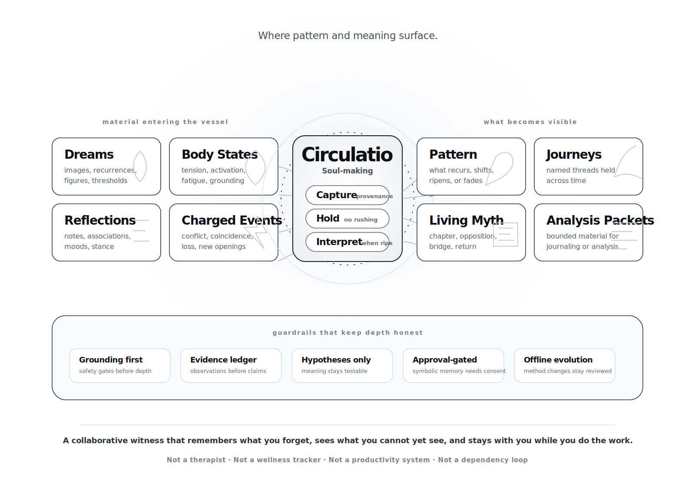

# Circulatio

> A Soul OS for Soul-Making.

Circulatio is the symbolic backend that turns a host agent like Hermes into an individuation companion. It holds your dreams, body-states, reflections, charged events, and threshold material across time, then interprets them through a Jungian depth lens when *you* decide the moment is right.

<p align="center">
  
</p>

It does not chase you. It does not gamify you. It does not collapse your symbols into productivity tips.

It **holds** first. It **remembers** what you forget. It **surfaces patterns** you cannot yet hold alone. And when you ask, it **interprets** with evidence, cultural amplification, and care for your conscious situation.

---

## Quickstart

```bash
git clone https://github.com/Sophanos/circulatio.git
cd circulatio
python -m venv .venv
source .venv/bin/activate
pip install -e ".[dev]"
python -m pytest tests/
```

**Already installed?**
```bash
pip install -e ".[dev]" --upgrade
```

**Evaluate method quality:**
```bash
.venv/bin/python scripts/evaluate_circulatio_method.py --strict
```

---

## What This Is

Circulatio is for people doing inner work — not as an escape from life, but as the ground beneath it.

- You remember dreams and sense they mean something, but you do not know how to read them.
- You feel patterns repeating and want to understand them at depth, not just manage symptoms.
- You believe the body carries intelligence and want to connect somatic experience with symbolic life.
- You are interested in Jungian depth psychology, archetypes, and individuation — but you want a practical tool, not just theory.
- You want a **witness** that accumulates with you, not a dashboard that reports on you.

## What This Is Not

- Not a wellness tracker (no calories, streaks, or mood scores).
- Not a productivity OS (no tasks, habits, or optimization loops).
- Not a therapy simulator (no diagnosis, no unqualified clinical language).
- Not a chatbot that interprets everything you drop into it.

## The Daily Rhythm

| Time | Experience |
|------|------------|
| **Morning** | A brief pattern surfacing — *"You dreamed of water three times this month. Yesterday you noted chest tension before a meeting. Want a 3-minute body check-in?"* You choose. No guilt. |
| **Day** | Drop a fragment: a dream, a body sensation, a strange coincidence, a mood shift. Circulatio stores it. It **holds** without pressing. |
| **Evening** | You ask: *"What is alive today?"* It weaves the morning's tension into the recurring water symbol, offers a cultural parallel as invitation, and asks a gentle question. |
| **Weekly** | A deeper synthesis: what recurred, what shifted, what was avoided, what new symbol emerged, what goal tension is visible. You read it like a journal you did not write alone. |

## Core Principles

1. **You are the source of insight.** Circulatio is the mirror that remembers.
2. **Pattern over interpretation.** A held recurrence is more powerful than a clever reading.
3. **Body is symbol.** Somatic events are as meaningful as dreams.
4. **Culture is amplification, not explanation.** Mythic parallels are resonance, not proof.
5. **Shadow work requires consent.** Offered, never imposed.
6. **The unconscious has its own timing.** Do not rush the door. Keep the key present.
7. **The goal is individuation, not optimization.** More conscious conflict is better than unconscious harmony.
8. **Success is obsolescence.** You should need Circulatio less over time, because you become your own witness.

## Architecture

Circulatio is a **durable backend** with a Hermes plugin bridge. Hermes owns routing, session orchestration, and scheduling. Circulatio owns:

- **Memory kernel** — typed, privacy-classed, provenance-bound
- **Graph engine** — derived symbol-to-symbol projections, no external graph DB
- **Context derivation** — native life-context built from your own records
- **LLM-first interpretation** — structured depth output with safety backstops
- **Approval flows** — symbolic writes are proposals until you accept them
- **Proactive runtime** — `alive_today`, rhythmic briefs, journey pages, and weekly reviews
- **Analysis surfaces** — threshold reviews, living myth reviews, and bounded analysis packets
- **Practice lifecycle** — recommendations, follow-ups, and integration, held lightly

```
You → Hermes (routing, rhythm, gateway)
         ↓
    Circulatio (memory, graph, interpretation, context)
         ↓
    SQLite (canonical storage)
```

## Current State

The embedded Hermes/backend runtime now substantially covers the implemented backend surface through Phases 1–9. The primary deferred track is **Phase 7 standalone distribution**.

- **Implemented:** hold-first capture, memory kernel, derived graph projections, native context derivation, LLM-first interpretation, soma/goal/culture layers, proactive rhythms, journey containers, threshold review, living myth review, bounded analysis packets, and approval-gated symbolic writes.
- **Builder tooling:** an offline Evolution OS now lives in `tools/self_evolution/`, covering prompt fragments, the Hermes skill, and tool descriptions with eval fixtures in `tests/evals/circulatio_method/`, candidate-bundle evaluation in `scripts/evaluate_circulatio_method.py`, and manual review-package staging in `scripts/evolve_circulatio_method.py`.
- **Best next user-facing work:** refine discovery/journey presentation quality, deepen practice and rhythm polish, and keep tightening method quality before widening the surface area.
- **Deferred:** standalone local packaging, broader presentation surfaces, reflective/pareto candidate generation, and a more polished product shell outside the Hermes embedding.
- **Source of truth:** `docs/ROADMAP.md` and `docs/ENGINEERING_GUIDE.md` track the current phase status and implementation scope in more detail than this README.

## Docs

- **Product & roadmap:** `docs/ROADMAP.md`
- **Technical spec:** `docs/ENGINEERING_GUIDE.md`
- **Hermeneutic method:** `docs/INTERPRETATION_ENGINE_SPEC.md`
- **Operations & safety:** `docs/RUNBOOK.md`
- **Offline Evolution OS:** `docs/SELF_EVOLUTION_OS.md`
- **Embodied presentation track:** `docs/EMBODIED_PRESENTATION_PLAN.md`
- **Agent guide:** `AGENTS.md`
- **What success feels like:** `docs/SUCCESS_VISION.md`

## Repo Layout

```
src/
  circulatio/               # Core library
    domain/                 # Types, records, graph vocab. No I/O.
    application/            # CirculatioService orchestrates workflows.
    core/                   # CirculatioCore, LLM orchestration, safety, evidence.
    repositories/           # In-memory + SQLite. No external graph DB.
    adapters/               # Context builder, Hermes/Life-OS adapters.
    hermes/                 # Bridge contracts, router, runtime wiring.
    llm/                    # Prompts, model adapter, JSON schema.
  circulatio_hermes_plugin/ # Hermes plugin (tools, commands, schemas, yaml)

tools/self_evolution/       # Offline Evolution OS builder tooling
scripts/                    # Eval + evolution entry points
tests/evals/                # Method eval fixtures (jsonl)
docs/                       # Roadmap, spec, runbook, success vision, etc.
```

## The Bottom Line

Circulatio is not a wellness tracker, a therapy chatbot, or a productivity optimizer.  
It is a **symbolic memory system for people doing inner work**.

While other apps interpret immediately or never at all, Circulatio **holds first**—storing your dreams, body-states, and charged events with patience. Over weeks and months, it surfaces **longitudinal patterns** across your own material, offering depth interpretation only when the moment is ripe and only with your explicit approval.

It treats your body as symbolic intelligence, your conflicts as meaningful tensions, and your unconscious as having its own timing. It does not gamify, diagnose, or chase retention. Its goal is simple: **to help you become your own witness**.

If you want an AI that optimizes your day, look elsewhere.  
If you want a companion that remembers what you forget and sees what you cannot yet hold alone, you are in the right place.

## License

MIT
